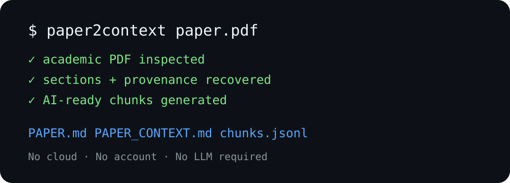

# Paper2Context

**Turn academic PDFs into provenance-rich, AI-ready research context.**

Paper2Context converts a born-digital scholarly PDF into a clean local context pack for researchers and AI agents. It does not require an LLM, an API key, an account, or a cloud service.



```bash
paper2context paper.pdf
```

```text
✓ pages processed
✓ sections detected
✓ figure/table captions detected
✓ references detected
✓ AI context chunks generated

paper_context/
├── PAPER.md
├── PAPER_CONTEXT.md
├── metadata.json
├── structure.json
├── references.json
├── assets.json
├── chunks.jsonl
├── manifest.json
└── source/extraction.json
```

> **Extract facts first. Interpret later.** Paper2Context preserves page provenance instead of inventing summaries.

## Why

PDF is a presentation format, not a research-context format. Page breaks, headers, footers, columns, captions, references, and section boundaries make downstream AI use brittle. Paper2Context recovers a conservative scholarly structure and exports it in formats that humans and tools can inspect.

## Features

- Local-first; no telemetry or network calls
- SHA-256 fingerprint of the source PDF
- PDF readiness diagnostics and OCR detection
- Header/footer and page-number cleanup heuristics
- Section and subsection detection
- Page provenance for extracted paragraphs
- Metadata and DOI extraction
- Reference-section extraction with raw-reference fallback
- Figure/table caption manifest
- Section-aware context chunks in JSONL
- Clean Markdown plus machine-readable JSON
- Confidence labels for imperfect extraction tasks

## Install

```bash
python -m pip install .
```

For development:

```bash
python -m pip install -e ".[dev]"
pytest
```

## Quick start

```bash
paper2context inspect paper.pdf
paper2context convert paper.pdf
# shorthand:
paper2context paper.pdf
```

Useful commands:

```bash
paper2context metadata paper.pdf
paper2context structure paper.pdf
paper2context references paper.pdf
paper2context figures paper.pdf
paper2context doctor
```

Choose an output folder:

```bash
paper2context convert paper.pdf -o ./my_context
```

## Provenance

`manifest.json` stores the SHA-256 of the input PDF. Paragraphs in `PAPER.md`, the internal structure, and chunks retain page provenance so extracted claims can be traced back to the source.

## Scope and limitations

v0.1.0 focuses on **born-digital academic PDFs**. It intentionally does not promise perfect OCR, equation understanding, complex table reconstruction, semantic summarization, or citation recommendations. Two-column and publisher-specific layouts are handled with conservative heuristics and may require review.

Image-only/scanned PDFs are detected and rejected with a clear OCR-required message rather than silently producing low-quality text.

## Privacy

Paper2Context operates on local files and makes no network requests. Your PDF remains on your machine. See [`docs/PRIVACY.md`](docs/PRIVACY.md).

## Design

See [`docs/ARCHITECTURE.md`](docs/ARCHITECTURE.md), [`docs/DATA_MODEL.md`](docs/DATA_MODEL.md), and [`docs/LIMITATIONS.md`](docs/LIMITATIONS.md).

## License

MIT. Third-party dependencies retain their own licenses.
